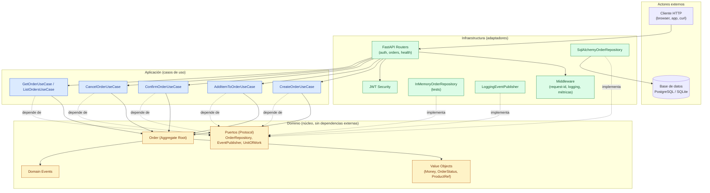
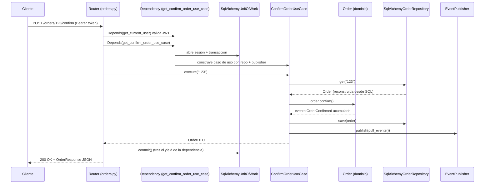
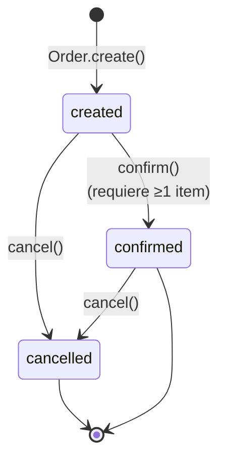

# Diagramas de arquitectura — Orders Service

## 1. Capas de la Arquitectura Hexagonal/Limpia

**Regla de dependencia (la más importante de Clean Architecture):** las flechas de
dependencia siempre apuntan hacia adentro. El dominio (amarillo) no importa nada de
aplicación (azul) ni de infraestructura (verde). La aplicación depende solo de
**puertos** (`Protocol`), nunca de adaptadores concretos. Infraestructura es la única
capa que conoce simultáneamente el dominio y el mundo exterior (FastAPI, SQLAlchemy).

## 2. Flujo de una petición (ej. `POST /orders/{id}/confirm`)

## 3. Máquina de estados de una Orden

